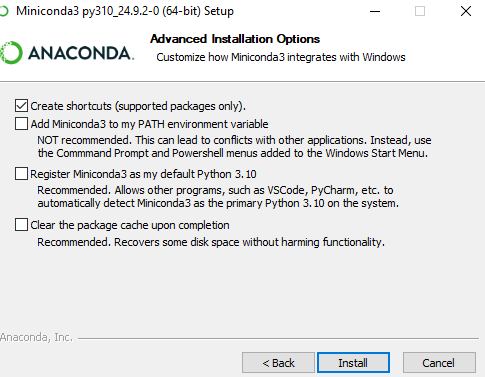
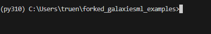
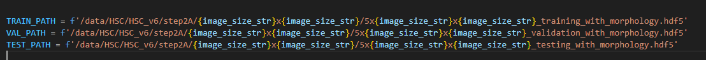
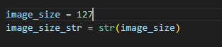

# GalaxiesML Examples

GalaxiesML is a dataset for use in machine learning in astronomy. This repository contains examples of how the GalaxiesML dataset can be used. 

The dataset is publicly available on **Zenodo** with the DOI: **[10.5281/zenodo.11117528](https://doi.org/10.5281/zenodo.11117528)**.

## Examples

- Redshift estimation - example of redshift estimation using photometry with a fully connected neural network and with images using a convolutional neural network (CNN).
- CUDA 11.8 required

Disclaimer: These instructions are designed for Windows, MAC or Linux may have slightly different commands

*Instructions:*

**Prologue**: Setting Everything Up

You will need do download the datasets from the link above (5x127x127 or 5x64x64):

5x64x64_training_with_morphology.hdf5
5x64x64_validation_with_morphology.hdf5
5x64x64_testing_with_morphology.hdf5
 

**Prerequisites:**

Visual Studio Code installed
Python Installed (3.10)
MiniConda Installed (Miniconda3-py310_24.9.2-0)

This guide will primarily focus on Windows operating systems and the CMD terminal. Commmands may differ slightly if you are on a different operating system or shell.

 
1) **Clone the Github repository**

Clone the Github Repository into Visual Studio Code  

2) **Install Miniconda**

Miniconda is a lightweight distribution of Conda, a package manager, and environment manager designed for Python and other programming languages. You will need to install Miniconda for Python 3.10. Here is the link to the download archive:
https://repo.anaconda.com/miniconda/
There are a lot of old installers here, the one you want is: "Miniconda3-py310_24.9.2-0-Windows-x86_64.exe	83.3M	2024-10-23 02:24:15" which can be found imediately using CTRL+F, pasting that, and pressing enter.

Download and run the Miniconda installer. For the purposes of this guide, you can leave everything unchecked except for "create shortcuts". This will allow you to keep existing Python installations exactly as they are and conda
won't affect them. However, if you are not concerned with previous python installations and intend to use conda for future projects, you can select "Add Miniconda to my PATH Environment Variable" which will allow the convenience of not
having to type the full path for each command, among other benefits. If you do not select this and change your mind after the fact, you can manually add miniconda to the PATH Environment Variable later if you wish. 

Additionally, if you are low on disk space, you can select "Clear the package cache upon completion".

3) **Miniconda Environment Creation**

Once Miniconda has been installed, we must now set it up in VS Code. Open a new CMD terminal from within Visual Studio Code
And type: "C:\Users\YourUsername\miniconda3\Scripts\conda.exe create -n py310 python=3.10" That should be the default path to the miniconda installation, however if it is installed elsewhere you will need to edit the path. You will also
need to replace "YourUsername" with your actual username, after that tap the enter key.

Type "y" + enter when prompted

Miniconda is now fully installed and ready to use. We will now create a conda environment which will help us manage all the project dependencies and various versions, type "C:\Users\YourUsername\miniconda3\Scripts\conda.exe create -n py310 python=3.10" into the terminal to get started. (Remember to change "YourUsername" to your actual user name, and adjust the path as needed)

4) **Miniconda Environment Activation/GPU Installation**

Now that the environment has been created, we must activate it and setup GPU support. From within VS Code type "CTRL+SHIFT+P"  and select "Python 3.10.16" After doing that, open a new CMD terminal and you should see a (py310) in front of your path. For example: 

Now type: "conda install -c conda-forge cudatoolkit=11.8 cudnn=8.9" into the terminal and press enter. This will install the necessary packages for GPU support (this may take a few moments depending on your internet speed)
 

3) Install Dependencies

    Run this command in your terminal: pip install -r requirements.txt (This may take a few minutes depending on your internet speed)

5) Open train_cnn_v3.py

    Replace these paths: 

    to the paths where the datsets are located on your local machine

    You also may need to edit this line 

    depending on what image size you downloaded (64 vs 127)

6) Run the training script

    From the terminal type "cd redshift_estimation" if you are not already in that directory
    Type "python train_cnn_v3.py --epochs 200 --batch_size 1024 --lr 5e-5" and press enter

    
    
   
