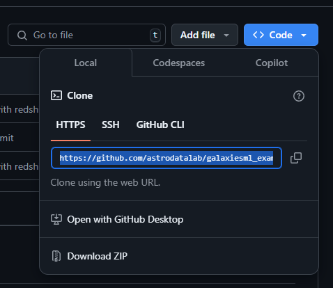
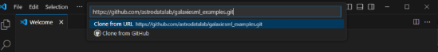
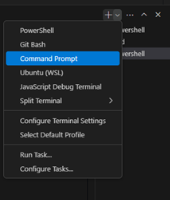
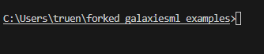
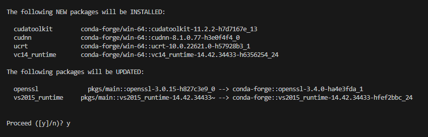
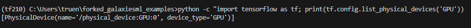

# GalaxiesML Examples

GalaxiesML is a dataset for use in machine learning in astronomy. This repository contains examples of how the GalaxiesML dataset can be used. 

The dataset is publicly available on **Zenodo** with the DOI: **[10.5281/zenodo.11117528](https://doi.org/10.5281/zenodo.11117528)**.

## Examples

- Redshift estimation - example of redshift estimation using photometry with a fully connected neural network and with images using a convolutional neural network (CNN).
 

# Table of Contents
- [Examples](#examples)
- [Setup Instructions](#setup-instructions)
  - [System Requirements](#system-requirements)
    - [Hardware Requirements](#hardware-requirements)
      - [Training Configuration](#training-configuration)
      - [Evaluation/Inference Configuration](#evaluationinference-configuration)
  - [Prerequisites](#prerequisites)
  - [Installation Steps](#installation-steps)
    1. [Clone the Github Repository](#1-clone-the-github-repository)
    2. [Install Miniconda](#2-install-miniconda)
    3. [Miniconda Environment Creation](#3-miniconda-environment-creation)
    4. [Miniconda Environment Activation/GPU Installation](#4-miniconda-environment-activationgpu-installation)
    5. [Install Dependencies](#5-install-dependencies)
    6. [Configure Training File](#6-configure-training-file)
    7. [Run the Training Script](#7-run-the-training-script)

## Setup Instructions
> **Disclaimer**: These instructions are designed for Windows, MAC or Linux may have slightly different commands

### **System Requirements**:

## Hardware Requirements

### System Requirements
```
| Component | Requirement                                     |
|-----------|------------------------------------------------|
| OS        | Windows 10/11 64-bit                           |
```

### Training Configuration

#### Minimum Specifications
```
| Component | Requirement                                     |
|-----------|------------------------------------------------|
| GPU       | NVIDIA GPU with 8GB VRAM (GTX 1070 or better)  |
| CPU       | Quad-core processor (Intel i5/AMD Ryzen 5)     |
| RAM       | 8GB DDR4 (16GB recommended)                    |
```

#### Recommended Specifications
```
| Component | Requirement                                     |
|-----------|------------------------------------------------|
| GPU       | NVIDIA GPU with 12GB+ VRAM (RTX 3060 Ti+)      |
| CPU       | 6+ core processor (Intel i7/AMD Ryzen 7)       |
| RAM       | 16GB DDR4                                      |
```

### Evaluation/Inference Configuration
```
| Component | Requirement                                     |
|-----------|------------------------------------------------|
| GPU       | NVIDIA GPU with 6GB+ VRAM                      |
| CPU       | Quad-core processor (Intel i5/AMD Ryzen 5)     |
| RAM       | 8GB DDR4                                       |
```

> **Note**: The application uses GPU memory management and data generators to optimize resource utilization. Performance may vary based on specific hardware configurations and concurrent system load. 

# **Prologue**: *Setting Everything Up*

You will need do download the datasets from the link above (5x127x127 or 5x64x64):

- 5x64x64_training_with_morphology.hdf5
- 5x64x64_validation_with_morphology.hdf5
- 5x64x64_testing_with_morphology.hdf5

## **Prerequisites**:

- Visual Studio Code installed
- MiniConda Installed (Miniconda3-py310_24.9.2-0)

 

# 1. **Clone the Github repository**

Clone the Github Repository into Visual Studio Code:

1. Copy the HTTPS link from the GitHub

   

2. Launch Visual Studio Code and select "Clone Git Repository"

   

3. Paste the HTTPS link into the bar and press enter 

   

4. Select a directory for the cloned repo to go in 

5. Select "open" when this prompt appears

   

6. Select "Yes, I trust the authors" 

   

# 2. **Install Miniconda**

Miniconda is a lightweight distribution of Conda, a package manager, and environment manager designed for Python and other programming languages. You will need to install Miniconda for Python 3.10.

1. Visit the download archive: https://repo.anaconda.com/miniconda/
2. Find the installer: "Miniconda3-py310_24.9.2-0-Windows-x86_64.exe	83.3M	2024-10-23 02:24:15" 
   - You can use CTRL+F to search for this exact filename
3. Download and run the installer
   - Leave everything unchecked except for "create shortcuts"
   - Optional: Select "Add Miniconda to my PATH Environment Variable" for convenience (however this may create conflicts with other Python versions)
   - Optional: Select "Clear the package cache upon completion" if low on disk space


# 3. **Miniconda Environment Creation**

1. Open a new CMD terminal in VS Code:

   

2. If it shows "powershell" instead of "cmd":

   

3. Create a new cmd terminal:

   

4. Ensure "cmd" is selected:

   

Your terminal should look like this:



Not like this (Powershell):


5. Create the environment by typing:
   ```
   C:\Users\YourUsername\miniconda3\Scripts\conda.exe create -n tf210 python=3.10
   ```
   - Replace "YourUsername" with your actual username
   - Adjust path if Miniconda is installed elsewhere

6. Type "y" when prompted:

   

# 4. **Miniconda Environment Activation/CUDA Installation**

1. Open Command Palette (CTRL + SHIFT + P)
2. Type "Python: Select Interpreter" and select Python 3.10.16 (tf210)

   

3. Open a new CMD terminal - you should see (tf210) in the path:

   

4. If (tf210) is not visible, manually activate:
   ```
   conda activate tf210
   ```
   or
   ```
   C:\Users\YourUsername\miniconda3\Scripts\conda.exe activate tf210
   ```

5. Install CUDA and cuDNN:
   ```
   conda install -c conda-forge cudatoolkit=11.2 cudnn=8.1
   ```

6. Type "y" when prompted:

   

# 5. **Install Dependencies**

1. Install requirements:
   ```
   pip install -r requirements.txt
   ```

2. Verify CUDA installation:
   ```
   python -c "import tensorflow as tf; print(tf.config.list_physical_devices('GPU'))"
   ```

   Successful output should look like:

   

   *Note: An empty list ([]) indicates TensorFlow is not detecting the GPU.*

# 6. **Configure Training File**

1. Open the train_cnn_v3.py file
2. Update the dataset paths to where you installed them, for example:

   

3. Save the file (CTRL + S)

# 7. **Run the Training Script**

1. Navigate to the correct directory:
   ```
   cd redshift_estimation
   ```

2. Start training:
   ```
   python train_cnn_v3.py --image_size 64 --epochs 200 --batch_size 256 --learning_rate 0.0001
   ```

### Training Parameters:
- **--image_size**: Set to 64 or 127 depending on the dataset you downloaded
- **--epochs**: Number of training epochs (default: 200)
- **--batch_size**: Number of samples per training batch (default: 256)
- **--learning_rate**: Learning rate for training (default: 0.0001)

Training progress will be displayed in the terminal, including loss values and other metrics. Checkpoints will be saved automatically during training. If using TensorBoard, logs will be available in /data2/logs/. Once training is complete, the trained model weights will be stored in /data2/models/.